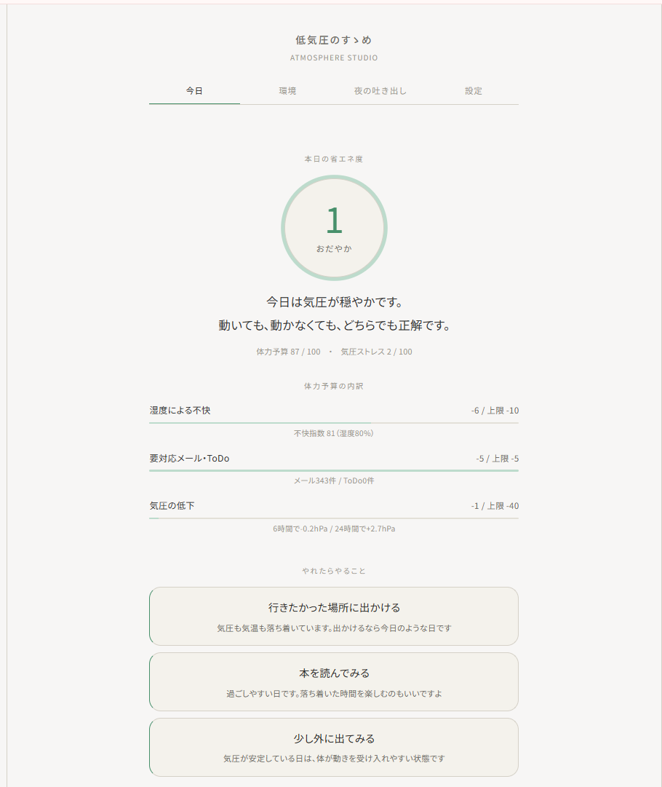
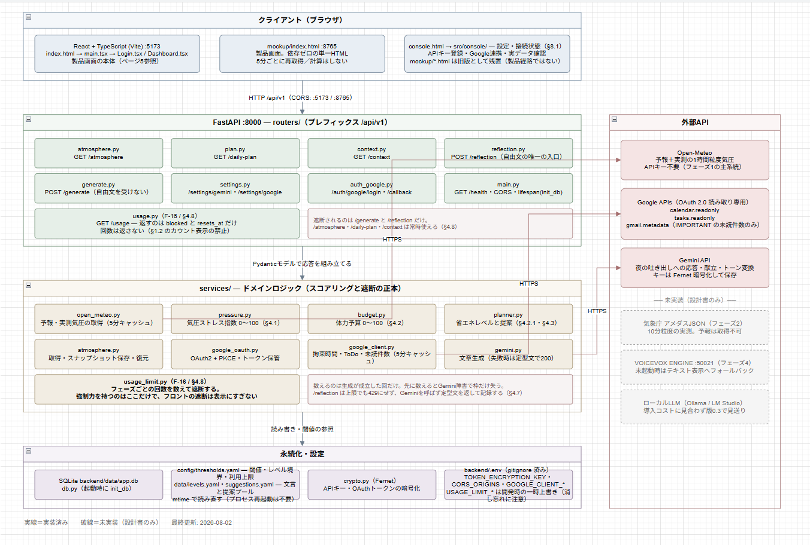

# チーム名

CON

# プロダクト名

停気圧

## 概要

気圧の変化から「今日どれだけ動けるか」を算定し、**頑張らない理由**を根拠つきで提示する省エネ提案アプリです。

天気・カレンダー・ToDo・未読メール件数から**体力予算**（0〜100）と**省エネレベル**（1〜5）を決め、
その日に「やらなくてもいいこと」を提案します。ストリーク・達成率・繰り越し・催促通知は**実装しません**。
できなかった日を記録しないことが、このアプリの設計思想です。

外部通信は Open-Meteo / Google API / Gemini API の3系統に限定した、完全ローカル動作のアプリケーションです。

## デモ画像



## システム構成



## 背景・課題

気圧が下がる日、頭が重くなり身体が動かなくなります。これは意志の問題ではなく大気の問題です。
にもかかわらず、その日は「自分が怠けた日」として記録され、翌日に持ち越されます。

既存の健康・習慣アプリには、ほぼ例外なく次の機能が載っています。

> 連続日数（ストリーク）／達成率／前日比・他者比較／未完了タスクの繰り越し／催促通知

これらは継続を促すのに有効な反面、**続けられなかった人を追い詰める装置**でもあります。
調子の悪い日に開くと、途切れた連続日数と繰り越された未完了項目が最初に目に入ります。

このプロダクトが解決したいのは、**体調不良を自己責任として処理してしまう構造**です。
気象データという外部の根拠を用いることで、「今日は気圧のせいです」と言い切れる状態をつくります。
低気圧そのものは突破できません。突破すべきなのは「それでも頑張らなければならない」という前提のほうです。

## 主な機能

- **気圧ストレス指数の算定** — 過去24時間と予報6時間の気圧変化から 0〜100 で数値化
- **体力予算の算定** — 気圧・気温・湿度・予定の拘束・メール／ToDo件数から、その日使える体力を 0〜100 で提示
- **省エネレベルの判定（1〜5）** — レベルごとに見出し文が変わり、Lv5では「何もしないこと」が目標になる
- **内訳の可視化** — 何が何点引いたかを、棒グラフと数値の両方で提示
- **省エネ提案** — そのレベルで許される負荷の範囲から最大3件。チェックボックスは付けない
- **夜の吐き出し（AI）** — 自由文を送ると Gemini が全肯定で受け止める。助言・励ましは返さない
- **Google連携（読み取り専用）** — カレンダーの拘束時間、ToDo件数、未読の重要メール**件数のみ**を取得
- **利用フェーズ制限** — 1日4フェーズごとに対話機能の回数上限を設け、アプリへの依存を防ぐ

## 工夫した点・こだわった点

### 体力予算アルゴリズム

- **変化率主軸** — 標高の高い土地が常時「低気圧」になるのを避けるため、気圧の高さではなく**下がり方**を見る
- **下降のみ加点** — 回復期の晴天日に「省エネしろ」と出さないため、気圧が下がる過程だけを負荷として数える
- **予報の先読み** — 体調は気圧に先行して崩れるため、これから6時間で下がる分も実測の半分の重みで加点する
- **因子ごとの上限** — 予定を詰めた日に気圧の寄与が見えなくなるのを防ぐため、単一要因が予算を食い尽くさないようにする
- **未計測と0の区別** — 測っていないことを測った結果に見せないため、未計測の因子は内訳に出さない
- **レベルは max(体力予算, 気圧ストレス)** — 気象要因だけでは最大60点しか引けず Lv4・5 に到達できないため、
  気圧ストレスにレベルの**下限**を持たせ、大きい方を採用する（このアルゴリズム最大の設計判断）
- **重い提案から選ぶ** — 軽い順だと全レベルで「何もしない」が筆頭になり差が消えるため、
  そのレベルで許される上限に近いものから選ぶ

### AIペルソナ

- **励まさない** — 善意の「明日は頑張って」が頑張れなかった人には次の宿題になるため、助言・励ましを明示的に禁止
- **外部帰属** — 「あなたのせいではない」と言うために算定しているので、原因を本人ではなく気象に置く
- **続けさせない** — 目的は画面を閉じてもらうことなので、100文字以内で、質問を返さず、会話を続けようとしない
- **失敗しても肯定を返す** — 500を返すと「吐き出したのに無視された」体験になるため、
  生成に失敗しても必ず肯定を返し、原因はログにだけ残す
- **自由文の入口を1本に絞る** — 利用者の言葉がどこから外部へ出るかを監査できるよう、
  自由文を受けるエンドポイントを1つに限定し、他の生成はサーバー側でプロンプトを組む
- **保存前に実呼び出しで検証** — 使えないモデルが保存されると画面上は何も異常に見えないため、
  設定保存の前に実際に1回生成して確かめる

## 使用技術

- **フロントエンド**：React 19 / TypeScript 6 / Vite 8
- **バックエンド**：Python 3.13 / FastAPI / Pydantic / uvicorn
- **AI / API**：Google Gemini API/ Open-Meteo / Google Calendar・Tasks・Gmail API
- **データベース**：SQLite
- **インフラ**：完全ローカル
- **その他**：pytest（169件）/ OAuth 2.0 + PKCE / Fernet（cryptography）/ ESLint

## 今後の展望

- **睡眠連携** — 睡眠不足を体力予算の減点要因に加える。予算モデルは実装済みで、入力経路のみ未実装
- **気圧耐性の個人化** — 「つらい／普通／平気」の体感記録を20日分ためて、しきい値の係数を個人ごとに調整する
- **推定稼働率の提示** — 現在は意図的に非公開。数値の見せ方が「達成率」に見えないか検討中
- **気象庁アメダスの併用** — 10分粒度の実測値で精度を上げる（Open-Meteo は1時間粒度）

## セットアップ方法

### 必要なもの

|                           | バージョン      | 備考                                                           |
| ------------------------- | --------------- | -------------------------------------------------------------- |
| Python                    | 3.13 で動作確認 | 3.11 以上であれば動作する見込み                                |
| Node.js                   | 20 以上         | Vite 8 系を使用                                                |
| Gemini APIキー            | 任意            | 無くても省エネ度の算定と表示は動く。夜の吐き出しだけが使えない |
| Google OAuth クライアント | 任意            | 無くても動く。その場合は天候のみで算定する                     |

### 1. バックエンド（:8000）

```powershell
git clone <repository-url>
cd <repository-name>/backend

python -m venv .venv                                             # 初回のみ
.\.venv\Scripts\python.exe -m pip install -r requirements.txt    # 初回のみ
.\.venv\Scripts\python.exe -m uvicorn app.main:app --reload --port 8000
```

> **仮想環境の python を明示して呼ぶこと。** グローバルの `python` には uvicorn も fastapi も
> 入っていないため、`python -m uvicorn ...` は `ModuleNotFoundError` で落ちます。

### 2. フロントエンド（:5173）

```powershell
cd frontend
npm install       # 初回のみ
npm run dev
```

| URL                                | 内容                                                                      |
| ---------------------------------- | ------------------------------------------------------------------------- |
| http://localhost:5173/             | **製品画面**（ダッシュボード）                                      |
| http://localhost:5173/console.html | **設定・接続状態コンソール**。APIキー登録・Google連携・実データ確認 |

> `127.0.0.1:5173` では繋がりません。Vite は `::1` でしか待ち受けないため、**必ず `localhost` で開いてください**。

### 3. 初回設定

外部サービス側で鍵を用意してから、アプリの設定画面に登録します。
**Gemini と Google はどちらも任意**で、両方とも未設定でも省エネ度の算定と表示は動きます。

#### 3-1. Gemini APIキーを取得する

1. [Google AI Studio](https://aistudio.google.com/app/apikey) を開き、Googleアカウントでログインする
2. **「Create API key」** を押し、既存のGoogle Cloudプロジェクトを選ぶか新規に作る
3. 表示された文字列をコピーする（**この画面を閉じると再表示できません**）

#### 3-2. Google OAuth クライアントを作る

[Google Cloud Console](https://console.cloud.google.com/) で作業します。手順は設定画面にも記載しています。

1. **プロジェクトを作成する**（既存のものでもよい）
2. **「APIとサービス」→「ライブラリ」** で次の3つを有効化する
   - Google Calendar API / Google Tasks API / Gmail API
3. **「APIとサービス」→「OAuth同意画面」**
   - User Type は **「外部」**、公開ステータスは **「テスト」のままでよい**（審査は不要）
   - **「テストユーザー」に自分のGoogleアカウントを追加する。**
     忘れると連携時に「アクセスをブロックしました」と出て先に進めません
4. **「認証情報」→「認証情報を作成」→「OAuth クライアント ID」**
   - アプリケーションの種類: **ウェブ アプリケーション**（デスクトップでは動作しません）
   - **承認済みのリダイレクト URI** に次の値を**そのまま**追加する

     ```
     http://localhost:8000/api/v1/auth/google/callback
     ```

     > `127.0.0.1` ではなく **`localhost`**。1文字でも違うと `redirect_uri_mismatch` で必ず失敗します。
     >
5. **「JSONをダウンロード」** で `client_secret_*.json` を保存する

要求する権限は次の3つで、**すべて読み取り専用**です。

| スコープ              | 用途                                                         |
| --------------------- | ------------------------------------------------------------ |
| `calendar.readonly` | 当日の拘束時間                                               |
| `tasks.readonly`    | 期限が今日以前のToDo件数                                     |
| `gmail.metadata`    | 未読の重要メール**件数のみ**（一覧も件名も取得しない） |

#### 3-3. アプリに登録する

1. `http://localhost:5173/console.html` を開く
2. 「設定」タブで **Gemini APIキー**（3-1）を貼り付けて保存する
3. Google連携を使う場合は、**3-2 でダウンロードしたJSONの中身をそのまま貼り付ける**
4. **「ID と シークレットを検証」** で資格情報だけを先に確認する（同意画面を出さずに正否が分かります）
5. **「Googleと連携する」** を押して同意画面で許可する

### テスト

```powershell
cd backend
.\.venv\Scripts\python.exe -m pytest -q     # 169件

cd frontend
npx tsc -b --noEmit
npm run lint
```

## メンバー

| 名前     | 担当           |
| -------- | -------------- |
| 中山遥登 | フロントエンド |
| 伊藤涼真 | バッグエンド   |
| 道下直斗 | バッグエンド   |
| 磯野晃汰 | フロントエンド |
| 阿部典   | バッグエンド   |

---

## 免責事項

気象データと体調の関連は、体感を説明するための目安として扱っています。

医学的な診断・治療の代替ではありません。

体調不良が続く場合は医療機関を受診してください。

## ライセンス

MIT License.

詳細は [LICENSE.md](LICENSE.md) を参照してください。
